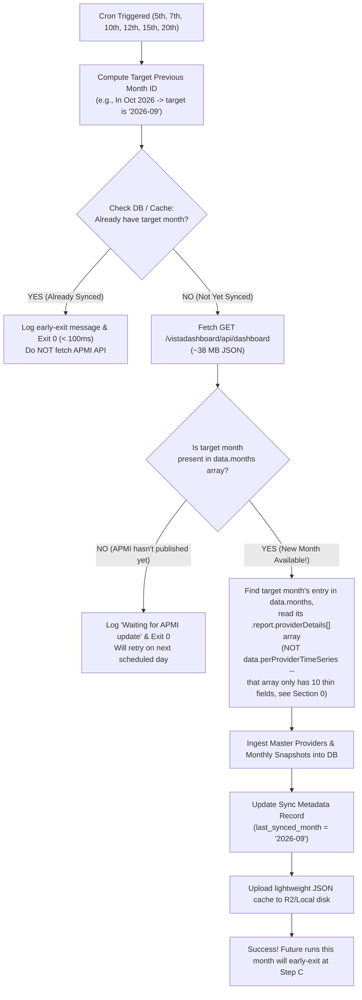

# APMI VISTA — SEBI PMS Compliance Ingestion & Application Plan

> **Document Version:** 2.0.0
> **Author:** Antigravity / Gemini Engineering (v1.0.0), revised by Claude (v2.0.0)
> **Reviewer:** Claude / Engineering Team
> **Status:** Revised — v1.0.0's core data-source assumption corrected after live verification
> **Target Date:** October 2026
> **Scope:** Full-industry Portfolio Management Services (PMS) compliance data ingestion, storage, scheduling, and UI integration in `MF-Analyzer-Abundance`.

---

## 0. Revision Notes (Claude review, 2026-10-08)

v1.0.0 was reviewed by actually fetching `https://www.apmiindia.org/vistadashboard/api/dashboard` live (37.64 MB, 200 OK, 1.2s) and inspecting the real response structure, rather than taking the plan's field-level claims on faith. The endpoint, its public/unauthenticated nature, the 18-month history, and the 510-provider figure are all **confirmed real** — good discovery. But the script/schema design in v1.0.0 pointed at the wrong part of the payload for per-provider detail. This revision fixes that. Everything not called out below (CLI interface, GitHub Actions workflow shape, performance/storage estimates) was checked and is sound as originally written.

**The one material finding:** the payload has three top-level arrays — `months` (18), `timeSeriesSummary` (18, industry-wide), `perProviderTimeSeries` (553, per-provider). v1.0.0's schema and script spec were written against `perProviderTimeSeries`, which only carries **10 fields** per provider-month (AUM totals, client total, two net-flow figures, two return figures) — none of the asset-class breakdown, complaints, or FY-level flow data the schema wanted. The real rich data — **110+ fields** per provider per month, including everything v1.0.0 wanted and considerably more — lives at `months[i].report.providerDetails[]`, a separate per-month array. Confirmed populated across all 18 months (467→510 providers as the industry grew), so a full backfill is viable, but it means looping over 18 month-keyed arrays rather than iterating one flat list.

Five smaller corrections, each verified against the live payload, not assumed:
1. **510 vs 553 providers**: 510 is exactly the count in the *latest* month (Aug 2026); 553 is every distinct `registrationNo` seen across all 18 months (the extra 43 stopped reporting before Aug 2026). The plan's "510 = 100% of the industry" should read "510 = currently active as of the latest published month."
2. **`status`/`is_active`**: APMI publishes a real `status` field ("Registered") per provider per month — use the latest month's value instead of a static default, which would mislabel the 43 lapsed providers.
3. **`disc_turnover_ratio`**: no such field exists anywhere in the payload, per-provider or industry-wide (the industry-level `transactions.discTurnoverRatio` is itself `null`) — this must be *computed* from `discSales`/`discPurchases`/AUM, not read.
4. **Derivatives granularity**: the real data splits derivatives three ways (`DerivEquity`/`DerivCommodity`/`DerivOthers`); the v1.0.0 schema had one `aum_disc_derivatives` column. Fixed to sum explicitly rather than accidentally mapping to one of the three.
5. **Duplicate month entries**: APMI's own source data has 2 providers (of 553) with a duplicated `monthId` in their series (`INP000006527`, `INP000005273`) — harmless under `ON CONFLICT DO UPDATE` but worth a log line so it's not silently invisible.

One open item, not a bug: as of today (Oct 8), APMI's latest published month is **August 2026**, not September — meaning the plan's "September data appears in mid-October" claim is unverified and the real publication lag may run longer than one month. The early-exit flowchart already handles "not yet published" safely either way (exit 0, retry next scheduled day), so this needs watching, not a code change.

---

## 1. Executive Summary

Under SEBI regulations, all registered Portfolio Managers in India submit mandatory monthly compliance reports to SEBI and APMI (Association of Portfolio Managers in India). APMI's new portal — **VISTA** (*Visual Industry Statistics & Trend Analytics*) — aggregates this data.

APMI's VISTA dashboard is powered by an open, unauthenticated REST API endpoint:
```http
GET https://www.apmiindia.org/vistadashboard/api/dashboard
```
* **Payload Size:** ~37.6 MB decompressed (confirmed live, 2026-10-08)
* **Authentication:** **None** (100% public JSON, zero credentials, zero scraping/HTML parsing needed)
* **Coverage:** **510 SEBI-registered PMS Providers active in the latest published month** (553 distinct providers appear somewhere across the full 18-month window — the difference is providers that stopped reporting before the latest month)
* **History:** **18 continuous monthly snapshots** (March 2025 to August 2026 as of October 2026)
* **Metrics (per provider, per month, from `months[i].report.providerDetails[]`):** AUM (Discretionary, Non-Discretionary, Advisory, Co-Investment), full Asset Class Allocation (Listed/Unlisted Equity, Plain/Structured Debt split further by listed/unlisted, three Derivative sub-types, Mutual Funds, Others), Client Counts (Domestic/Foreign, by service type, plus EPFO/PF and corporate/NRI/FPI breakdowns), Monthly *and* FY-level Gross/Net Flows, and Investor Complaints (pending/received/resolved). Turnover ratio is not published and must be computed from sales/purchases/AUM.

This plan details the database schema, ingestion script, scheduling with idempotent monthly polling, and user-facing integration into `MF-Analyzer-Abundance`.

---

## 2. Ingestion & Polling Architecture

### 2.1 The Scheduling Challenge & Requirements
* **Publishing Window:** AMCs submit data by the 7th–10th of each month; APMI aggregates and updates VISTA with roughly a one-month lag, though the exact lag is unconfirmed beyond "at least one month" (see Revision Notes above — verify the actual September 2026 publish date when it happens, rather than assuming mid-October).
* **Target Schedule:** Run on the **5th, 7th, 10th, 12th, 15th, and 20th** of every month.
* **Idempotency & Early-Exit Guard:** The script must **not** re-download the ~38 MB payload once that month's new data has already been ingested.

### 2.2 Execution Flowchart



---

## 3. Database Schema Design (PostgreSQL)

To preserve performance and keep queries fast, we split the dataset into two relational tables plus a sync metadata table. Column selection below covers what the Section 6 roadmap actually uses (badges, directory sort/filter, comparison drawer) rather than all 110+ fields `providerDetails` carries — the remaining fields (PF/EPFO breakdown, corporate/NRI/FPI client splits) are real and available in the source payload if a later phase needs them, just not captured in this version.

### 3.1 Master Providers Table: `pms_providers`
Stores static and slowly-changing information for each SEBI-registered portfolio manager.

```sql
CREATE TABLE IF NOT EXISTS pms_providers (
  id SERIAL PRIMARY KEY,
  registration_no VARCHAR(50) UNIQUE NOT NULL, -- e.g. 'INP000009959' -- confirmed live: 100% match this format, zero duplicates across 553 providers
  name VARCHAR(255) NOT NULL,                  -- e.g. 'Abakkus Investment Managers Private Limited'
  normalized_slug VARCHAR(255) UNIQUE NOT NULL,-- e.g. 'abakkus-investment-managers'
  status VARCHAR(50),                          -- from the LATEST month's real `status` field (e.g. "Registered") -- do not default statically, see Section 0 point 2
  first_seen_month VARCHAR(7),                 -- e.g. '2025-03'
  latest_month VARCHAR(7),                     -- e.g. '2026-08'
  latest_aum_cr NUMERIC(14, 2),                -- grandTotalAum from latest month this provider appears in
  latest_clients INT,                          -- clientsTotal from latest month this provider appears in
  is_active BOOLEAN GENERATED ALWAYS AS (latest_month = (SELECT value FROM pms_sync_state WHERE key = 'latest_synced_month')) STORED,
  -- ^ derived from real data (does this provider appear in the current latest month), not a static default --
  --   of the 553 providers ever seen, ~43 stop appearing before the current month and should read is_active = false.
  --   If a generated column proves awkward in practice, compute this in the application query instead; either way,
  --   don't hardcode DEFAULT TRUE.
  created_at TIMESTAMPTZ DEFAULT NOW(),
  updated_at TIMESTAMPTZ DEFAULT NOW()
);

CREATE INDEX IF NOT EXISTS idx_pms_providers_slug ON pms_providers(normalized_slug);
CREATE INDEX IF NOT EXISTS idx_pms_providers_aum ON pms_providers(latest_aum_cr DESC);
```

### 3.2 Monthly Compliance Snapshots: `pms_provider_monthly_snapshots`
Stores the detailed compliance report per provider per month, sourced from `months[i].report.providerDetails[]` for the target month `i` — **not** `perProviderTimeSeries` (see Section 0).

```sql
CREATE TABLE IF NOT EXISTS pms_provider_monthly_snapshots (
  id SERIAL PRIMARY KEY,
  registration_no VARCHAR(50) REFERENCES pms_providers(registration_no) ON DELETE CASCADE,
  month_id VARCHAR(7) NOT NULL,       -- 'YYYY-MM', e.g. '2026-08' -- from data.months[i].id
  month_label VARCHAR(50) NOT NULL,    -- e.g. 'August 2026'

  -- AUM Breakdown (in INR Crores) -- providerDetails[].grandTotalAum / aumDiscretionaryTotal / aumNonDiscretionaryTotal / advisoryAum / coInvTotal
  grand_total_aum NUMERIC(14, 2) NOT NULL,
  aum_discretionary NUMERIC(14, 2) DEFAULT 0,
  aum_non_discretionary NUMERIC(14, 2) DEFAULT 0,
  aum_advisory NUMERIC(14, 2) DEFAULT 0,       -- source field is `advisoryAum`, not present in v1.0.0's schema at all
  aum_co_investment NUMERIC(14, 2) DEFAULT 0,  -- source field is `coInvTotal`

  -- Client Counts -- providerDetails[].clientsTotal / clientsDiscretionary / etc. / totalDomesticClients / totalForeignClients
  clients_total INT NOT NULL,
  clients_discretionary INT DEFAULT 0,
  clients_non_discretionary INT DEFAULT 0,
  clients_advisory INT DEFAULT 0,
  clients_co_investment INT DEFAULT 0,
  clients_domestic INT DEFAULT 0,              -- source: totalDomesticClients
  clients_foreign INT DEFAULT 0,               -- source: totalForeignClients

  -- Asset Class Allocation -- providerDetails[].aumTotal* (combined disc+nd; use aumDisc*/aumNd* instead if the
  -- discretionary/non-discretionary split matters more than the combined total for a given use case)
  aum_equity_listed NUMERIC(14, 2) DEFAULT 0,       -- aumTotalEquityListed
  aum_equity_unlisted NUMERIC(14, 2) DEFAULT 0,     -- aumTotalEquityUnlisted
  aum_plain_debt_listed NUMERIC(14, 2) DEFAULT 0,   -- aumTotalPlainDebtListed
  aum_plain_debt_unlisted NUMERIC(14, 2) DEFAULT 0, -- aumTotalPlainDebtUnlisted
  aum_struct_debt_listed NUMERIC(14, 2) DEFAULT 0,  -- aumTotalStructDebtListed
  aum_struct_debt_unlisted NUMERIC(14, 2) DEFAULT 0,-- aumTotalStructDebtUnlisted
  aum_derivatives NUMERIC(14, 2) DEFAULT 0,         -- SUM of aumTotalDerivEquity + aumTotalDerivCommodity + aumTotalDerivOthers
                                                     -- (real data has 3 separate fields; v1.0.0 had 1 column mapped to none of them explicitly -- this is now an explicit sum, not an accident)
  aum_mutual_funds NUMERIC(14, 2) DEFAULT 0,        -- aumTotalMutualFund
  aum_others NUMERIC(14, 2) DEFAULT 0,              -- aumTotalOthers

  -- Flows & Trading Activity (in INR Crores) -- providerDetails[].disc*/nd*
  disc_inflow_month NUMERIC(14, 2) DEFAULT 0,
  disc_outflow_month NUMERIC(14, 2) DEFAULT 0,
  disc_net_month NUMERIC(14, 2) DEFAULT 0,
  disc_inflow_fy NUMERIC(14, 2) DEFAULT 0,     -- real field, not in v1.0.0's schema
  disc_outflow_fy NUMERIC(14, 2) DEFAULT 0,    -- real field, not in v1.0.0's schema
  disc_net_fy NUMERIC(14, 2) DEFAULT 0,
  disc_sales NUMERIC(14, 2) DEFAULT 0,
  disc_purchases NUMERIC(14, 2) DEFAULT 0,
  disc_turnover_ratio NUMERIC(8, 4),           -- COMPUTED: (disc_sales + disc_purchases) / 2 / NULLIF(aum_discretionary, 0)
                                                -- not sourced -- no turnover field exists anywhere in the payload, confirmed live (see Section 0 point 3)

  -- Complaints -- providerDetails[].complaints*
  complaints_pending_start INT DEFAULT 0,
  complaints_received INT DEFAULT 0,
  complaints_resolved INT DEFAULT 0,
  complaints_pending_end INT DEFAULT 0,

  -- Reported Returns -- providerDetails[].return1Month / return1Year (populated even for each provider's first
  -- month in the series, unlike the industry-level timeSeriesSummary's return fields which are null for month 1 --
  -- confirmed live; worth a spot-check before trusting these for a comparison UI, since a PMS's "return" is
  -- strategy-dependent and this is one blended per-provider figure, not per-strategy)
  return_1m NUMERIC(7, 2),
  return_1y NUMERIC(7, 2),

  created_at TIMESTAMPTZ DEFAULT NOW(),
  CONSTRAINT uq_pms_provider_month UNIQUE (registration_no, month_id)
);

CREATE INDEX IF NOT EXISTS idx_pms_snapshots_reg_month ON pms_provider_monthly_snapshots(registration_no, month_id DESC);
CREATE INDEX IF NOT EXISTS idx_pms_snapshots_month_aum ON pms_provider_monthly_snapshots(month_id, grand_total_aum DESC);
```

### 3.3 Sync State & Metadata: `pms_sync_state`
Lightweight table to verify whether a given calendar month has already been processed without querying millions of rows.

```sql
CREATE TABLE IF NOT EXISTS pms_sync_state (
  key VARCHAR(50) PRIMARY KEY,
  value VARCHAR(255) NOT NULL,
  updated_at TIMESTAMPTZ DEFAULT NOW()
);
```

---

## 4. Script Specification (`scripts/sync_apmi_vista.mjs`)

### 4.1 CLI Interface
```bash
# Standard scheduled run (respects early-exit guard)
node scripts/sync_apmi_vista.mjs

# Dry-run mode (fetches and validates without DB writes)
node scripts/sync_apmi_vista.mjs --dry-run

# Force run (bypasses early-exit check, backfills all 18 historical months)
node scripts/sync_apmi_vista.mjs --force
```

### 4.2 Step-by-Step Script Implementation Logic

1. **Calculate Target Month:**
   ```javascript
   function getTargetMonth(date = new Date()) {
     // If run in October 2026, target is September 2026 ('2026-09')
     // JS Date correctly rolls the year back when month - 1 is negative
     // (e.g. run in January -> month - 1 = -1 -> December of the prior year), verified.
     const d = new Date(date.getFullYear(), date.getMonth() - 1, 1);
     const yyyy = d.getFullYear();
     const mm = String(d.getMonth() + 1).padStart(2, '0');
     return `${yyyy}-${mm}`;
   }
   ```

2. **Early-Exit Check:**
   * Query `pms_sync_state WHERE key = 'latest_synced_month'`.
   * If `value === targetMonth` and `--force` is not present:
     * Print: `[APMI VISTA Sync] Already have ${targetMonth} ingested this cycle. Skipping live download.`
     * Exit immediately with status 0.

3. **Fetch & Validate APMI API:**
   * Fetch `https://www.apmiindia.org/vistadashboard/api/dashboard` with a generous timeout (the live payload is ~38 MB; 30s may be tight depending on the runner's network -- 60s is safer, confirmed live fetch took ~1.2s from a residential connection but GitHub Actions runners can vary) and JSON parse.
   * Find the target month: `const monthEntry = data.months.find(m => m.id === targetMonth);`
   * If not found:
     * Print: `[APMI VISTA Sync] APMI VISTA has not published ${targetMonth} yet (latest is ${data.months.at(-1)?.id}). Will retry on next scheduled day.`
     * Exit with status 0.

4. **Extract & Batch Upsert into PostgreSQL:**
   * Read `monthEntry.report.providerDetails` — an array of ~510 objects, one per active provider for that month. **Not** `data.perProviderTimeSeries` (see Section 0 for why).
   * Run within a single database transaction.
   * Upsert master providers into `pms_providers` from this same array's `name`/`registrationNo`/`status` fields (`ON CONFLICT (registration_no) DO UPDATE ...`), scoped to providers present in `monthEntry.report.providerDetails` for this run — a provider that stopped reporting before the target month simply isn't touched, which correctly leaves its `latest_month`/`is_active` reflecting its real last appearance.
   * Upsert the new month's snapshots into `pms_provider_monthly_snapshots` (`ON CONFLICT (registration_no, month_id) DO UPDATE ...`), computing `disc_turnover_ratio` as described in Section 3.2 rather than reading it.
   * If a `registrationNo` appears more than once within `providerDetails` for the same month (APMI's own source has 2 such duplicates across the full dataset, see Section 0 point 5), log a warning naming the registration number rather than silently upserting twice.
   * Update `pms_sync_state` set `latest_synced_month = targetMonth`.
   * **`--force` backfill**: loop over all 18 entries in `data.months`, repeating this extraction for each one's `report.providerDetails` — confirmed live that every month (not just the latest) has this array fully populated (467 providers in March 2025, growing to 510 by August 2026), so a full 18-month backfill is viable in one run.

5. **Emit Static JSON Summary:**
   * Write a lightweight (~50 KB) summary of the latest month (`data/pms-compliance-summary.json` and upload to Cloudflare R2 if configured) for fast Next.js static rendering.

---

## 5. GitHub Actions Workflow (`.github/workflows/apmi-vista-sync.yml`)

Runs on the **5th, 7th, 10th, 12th, 15th, and 20th** of each month at 04:30 UTC (10:00 AM IST):

```yaml
name: Monthly APMI VISTA PMS Compliance Sync

on:
  schedule:
    # Staggered polling: 5th, 7th, 10th, 12th, 15th, and 20th of every month
    # Exits in < 100ms once the target month has been ingested.
    - cron: '30 4 5,7,10,12,15,20 * *'
  workflow_dispatch:
    inputs:
      force:
        description: 'Force sync even if month already exists'
        required: false
        default: false
        type: boolean

jobs:
  sync-apmi-vista:
    runs-on: ubuntu-latest
    steps:
      - name: Checkout repository
        uses: actions/checkout@v4

      - name: Setup Node.js
        uses: actions/setup-node@v4
        with:
          node-version: 24

      - name: Install dependencies
        run: npm install pg aws4fetch --no-save

      - name: Run APMI VISTA Sync
        env:
          POSTGRES_URL: ${{ secrets.POSTGRES_URL }}
          R2_ACCOUNT_ID: ${{ secrets.R2_ACCOUNT_ID }}
          R2_ACCESS_KEY_ID: ${{ secrets.R2_ACCESS_KEY_ID }}
          R2_SECRET_ACCESS_KEY: ${{ secrets.R2_SECRET_ACCESS_KEY }}
          R2_BUCKET_NAME: ${{ secrets.R2_BUCKET_NAME }}
        run: |
          if [ "${{ inputs.force }}" = "true" ]; then
            node scripts/sync_apmi_vista.mjs --force
          else
            node scripts/sync_apmi_vista.mjs
          fi
```

---

## 6. Application Integration Plan

### Phase 1: Strategy Enrichment on `/pms-preferred`
* **Current State:** Strategy cards rely on factsheet PDFs. AUM and client figures are often missing or out-of-date.
* **Enhancement:**
  * Map strategy providers in `/pms-preferred` (e.g. Abakkus, Marcellus, ValueQuest, ASK) to their `registration_no` in `pms_providers`. Provider names in the APMI data are inconsistently cased/formatted ("CHONA FINANCIAL SERVICES LTD" vs "1729 Advisors LLP") — reuse the fuzzy-matching approach `lib/pmsFactsheetsCache.js` already uses for factsheet matching rather than assuming exact-string matches.
  * Display verified **SEBI Compliance Badges**:
    * 🛡️ *Verified SEBI AUM: ₹22,954 Cr (Aug 2026)*
    * 👥 *Active Investors: 12,117 clients*
    * 💼 *Asset Allocation: 97.4% Listed Equity, 2.6% Cash/Liquid*
    * 📊 *Portfolio Turnover: 0.18x (computed, see Section 3.2)*

### Phase 2: PMS Industry Directory & Screener (`/pms-directory` or `/pms-pulse`)
* A new public, SEO-optimized page listing all 510 currently-active SEBI PMS providers.
* **Sort & Filters:**
  * By Total AUM, Discretionary AUM, Advisory AUM.
  * By Net Monthly Flows (₹ Cr) — see where HNI capital is flowing.
  * By Investor Count & Average Ticket Size (`AUM / Total Clients`).
  * By computed Trading Turnover Ratio (Active vs Buy-and-Hold).
  * Filter providers with unlisted equity or structured debt exposure.

### Phase 3: Provider Comparison Drawer
* In the `/pms-preferred` compare tool, add an **AMC Institutional Strength** section:
  * Compare 18-Month AUM Trajectory (Recharts graph).
  * Net Flows vs Outflows over the past 4 quarters (month *and* FY-level flow fields are both available, see Section 3.2).
  * Complaint Resolution Track Record (0 pending vs unresolved).

---

## 7. Performance & Storage Optimizations

| Concern | Mitigation |
| :--- | :--- |
| **~38 MB Download Overhead** | Prevented by the early-exit check. The download only occurs **1 to 2 times per month** until the new month is published, then 0 times for the rest of the month. |
| **Node.js Memory Footprint** | Parsing a 38 MB JSON string in Node.js requires ~150 MB heap, well within GitHub Actions' 7 GB runner limit. |
| **Database Storage Footprint** | 510 providers × 18 months ≈ **9,180 snapshot rows** at the v2.0.0 column set. In PostgreSQL, this requires well under 50 MB of table storage even after several years. |
| **Next.js Page Speed** | Frontend pages will query a lightweight materialized summary or pre-aggregated JSON cache (`pms-compliance-summary.json`), avoiding large runtime joins. |

---

## 8. Verification & Review Checklist

- [x] **Idempotency Guard:** Correct as designed — matches `scripts/sync_sif_aum.js`'s proven pattern (peek stored state, compare target month, skip the live fetch entirely if already current).
- [x] **Month Offset Logic:** Correct — `getTargetMonth()`'s arithmetic correctly rolls the year back in January via JS's native Date handling.
- [x] **Database Schema:** `NUMERIC(14,2)` precision is sufficient (verified against real AUM magnitudes up to 7 digits). Field mapping corrected in v2.0.0 — see Section 3.2's inline source-field comments.
- [x] **SEBI Registration ID Consistency:** Confirmed live — 100% of 553 distinct providers match `INP\d+`, zero duplicates. Sound as a primary key.
- [x] **Alignment with Existing Codebase:** Polling/early-exit/workflow structure correctly mirrors `scripts/sync_sif_aum.js` and `.github/workflows/sif-aum-sync.yml`. Script's own self-contained-vs-shared-lib conventions should follow whichever this codebase's other standalone sync scripts use (check `scripts/sync_sif_aum.js` and `scripts/build-sif-screener.mjs` for the established pattern before writing `sync_apmi_vista.mjs`).
- [x] **Data source verified live, not assumed:** v1.0.0's schema and script spec were built against `perProviderTimeSeries`, which does not carry the fields the schema wants. Corrected to `months[i].report.providerDetails[]` throughout this revision — see Section 0.
